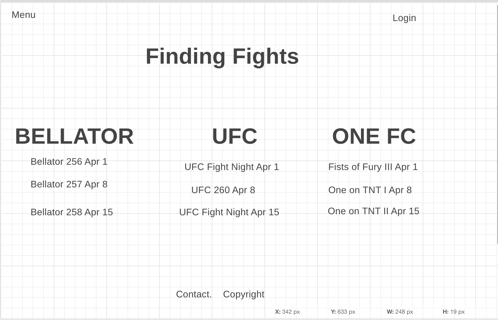

# findingFights

[View Site](https://finding-fights-app.herokuapp.com/ufc)

It is hard to keep track of when all the fights from the different organizations are on and where to watch them.  So this will be a solution to bring all these organizations, and in the future the organizations of multiple combat sports into one place.

1. As a user, I should be able to make a username and password.

2. As a user, I should be able to view a list of MMA organizations and upon clicking open up their index page of upcoming fights.

3. As a admin, I should be able to add fights to the index.

4. As a admin, I should be able to edit fights.

5. As a admin, I should be able to delete fights.

6. As a user, I should be able to go to a show page with more information of the fights.

Technologies used: MongoDB, mongoose, express, bcrypt, bootstrap, and ejs.  I will be using CRUD operations.

Stretch Goals:
1. Add more models for different combat sports such as boxing.

2. Role authentication

2. Include sign up/log in functionality, with encrypted passwords & an authorization flow

3. Use EJS Partials

4. Use a CSS framework like Skeleton or Bootstrap

5. Use a third party API

6. Incorporate Google Maps

7. Allow users to upload files with Multer

8. Enable real time communication with socket.io
